# 🤳 Инструменты для анализа аккаунтов в Телеграм

<figure><figcaption></figcaption></figure>

## **Этап 1**&#x20;

### Узнаём ID пользователя

Работать в рамках этой статьи как вы догадались мы будем в основном с телеграм-ботами. Большинство ботов просят в качестве входных данных уникальный идентификатор пользователя. Получить его довольно просто, разберём три способа которыми я пользуюсь.

### **При помощи бота**

Как бы банально это не было, но идентификатор можно спокойно получить через того же [Leakedinfobot](leakedinfobot-luchshii-bot-dlya-poiska-slitoi-informacii..md), нужно лишь только ввести никнейм и выбрать телеграм.

<figure>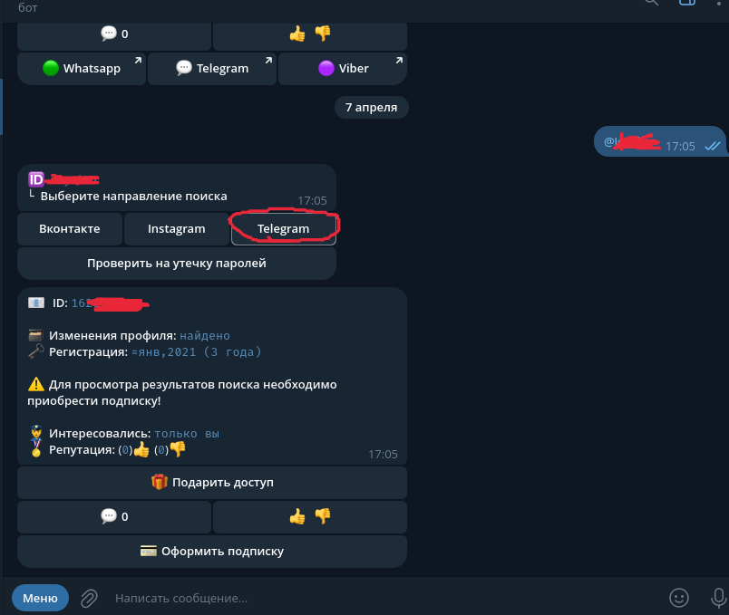<figcaption></figcaption></figure>

### **Официальный клиент Telegram на ПК**

Ещё один простейший способ – это при помощи клиента Telegram на ПК.\
Для этого заходим в настройки –> Продвинутые настройки –> Экспериментальные настройки –> Show Peer IDs in Profile.

<figure><figcaption></figcaption></figure>

Теперь у каждого пользователя в профиле мы можем сразу же увидеть его id.

<figure>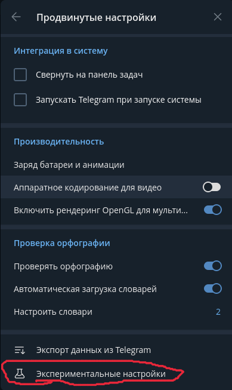<figcaption></figcaption></figure>

<figure>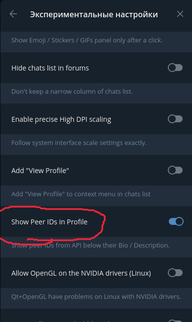<figcaption></figcaption></figure>

<figure>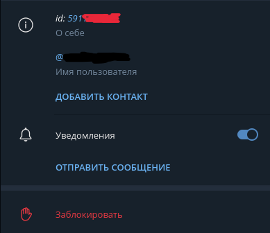<figcaption></figcaption></figure>

### **BGram Android**

Модификация клиента Telegram для Android в которой уже встроена эта функция по умолчанию.

<figure>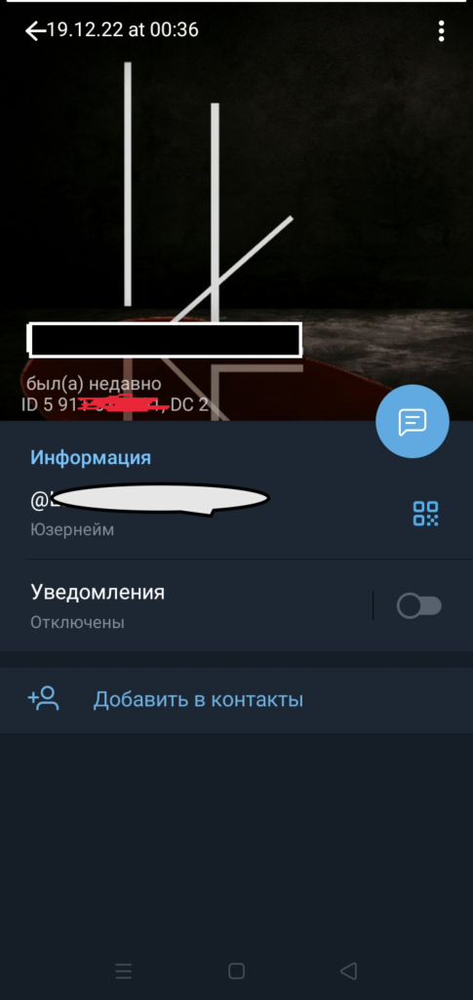<figcaption></figcaption></figure>

## **Этап 2**

### Узнаём различную информацию о пользователе при помощи ботов

### **Leakedinfobot**

При помощи [всеми известного бота](leakedinfobot-luchshii-bot-dlya-poiska-slitoi-informacii..md) можно выяснить в цело репутацию аккаунта (была ли какая-либо информация в утечках).

<figure>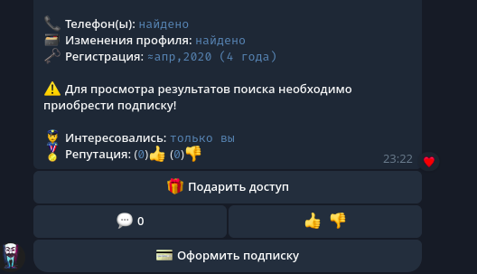<figcaption></figcaption></figure>

Как можем наблюдать, аккаунт уже весьма поживший и базах имеется номер телефона, эта информация нам очень пригодится для условно бесплатных ботов.

### **Insight**

На мой скромный взгляд, является одним из лучших условно-бесплатных ботов для разведки телеграм аккаунтов. Определяет хобби владельца, возможное местоположение и много-много чего интересного, один из ярких примеров вы можете наблюдать снизу.

<figure>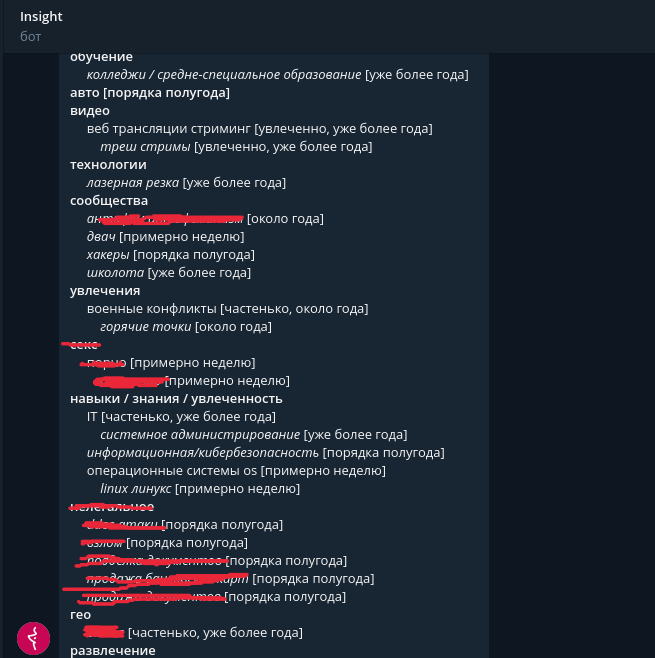<figcaption></figcaption></figure>

Для сбора общего портрета о человеке, вполне хороший бот. Валюту для поиска довольно просто получить, бот сам время от времени будет давать тебе понемногу валюты на счёт, опять же всё зависит от того, как часто ты им пользуешься и сколько у тебя аккаунтов.

### **fun-stat-bot**

[Ещё один классный бот](https://t.me/funstatbot) для сбора общей информации о пользователе, как и предыдущий бот он собирает интересы пользователя исходя из сообществ в которых он состоит. Может выдать прошлые имена аккаунта, ещё что очень интересно, так это сообщения пользователя в публичных чатах даже если они были удалены пользователем ранее.

<figure>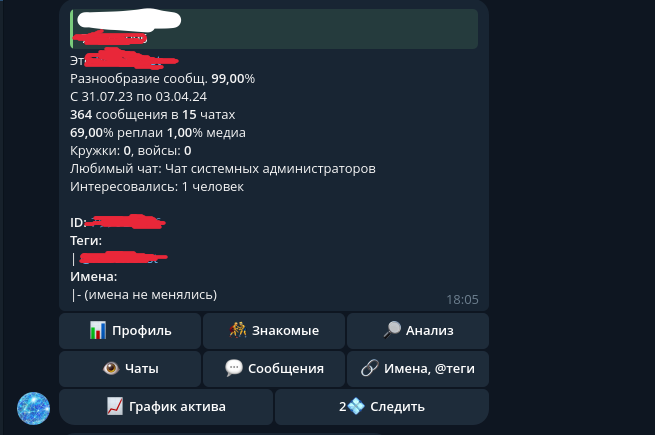<figcaption></figcaption></figure>

Здесь нас приветствует множество пунктов после того как мы ввели id целевого аккаунта, давайте рассмотрим все пункты которые нам доступны. Но вначале радоваться не стоит, так как все пункты открываются за валюту бота “кристаллы знаний”. Этой валютой бот делится щедро с вами при первом заходе в бота, и дарит он вам аж целых 20 кристаллов. Валюта может копиться и сама по себе в небольших объёмах.

Первый пункт – это профиль, в нём нам предоставлена информация о том, насколько в целом активен аккаунт, а исходя из этого уже можно сделать вывод о том, основной это аккаунт или нет. Плюс может быть дополнительные имена/теги, а значит и новые никнеймы по которым можно с нуля также начать поиск.

<figure>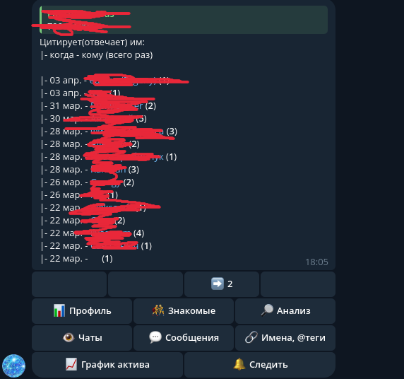<figcaption></figcaption></figure>

В пункте “Знакомые” мы можем наблюдать кому пользователь чаще всего отвечает, в публичных чатах разумеется, и логически выяснив с кем пользователь знаком.

<figure>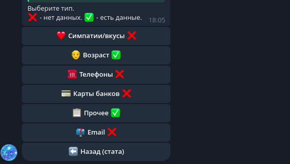<figcaption></figcaption></figure>

<figure>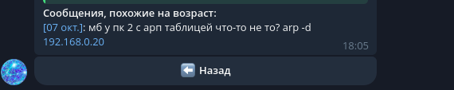<figcaption></figcaption></figure>

В пункте “анализ” бот анализирует содержимое сообщений и исходя из этого содержимого делает предположения о симпатиях, возрасте, номере телефона и прочем. Правда где-то местами некорректно выводит, например за “возраст” он посчитал вот это сообщение.

<figure>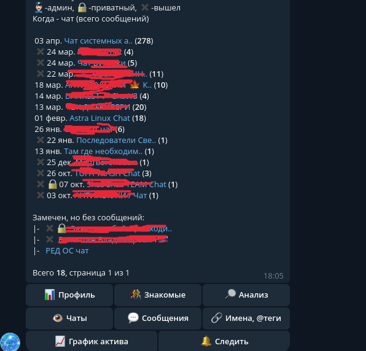<figcaption></figcaption></figure>

Пункт “Чаты” мне очень нравится, т.к в нём максимально подробно показано в каких чатах состоит/состоял пользователь.

<figure><figcaption></figcaption></figure>

Очень подробный пункт “Сообщения”, в котором мы будто во вложениях чата Вконтакте можем посмотреть картинки, видео, ссылки и прочие виды сообщений которые присылал пользователь, или же можем просто посмотреть их все.

<figure>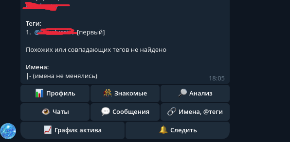<figcaption></figcaption></figure>

Теги, имена пользователя, тоже могут быть крайне полезны.

<figure>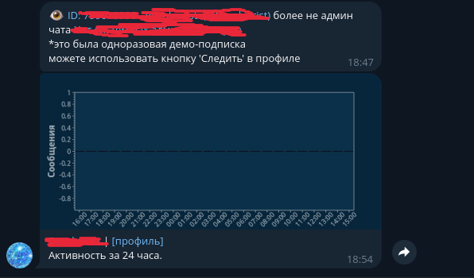<figcaption></figcaption></figure>

Очень любопытной функцией является слежка за пользователем и за его активностью в сети, бывает полезно.

### **TeleSINT**

Ещё один бот, который определит в каких беседах состоит пользователь. Особо добавить мне нечего, т.к его я использую чтобы попробовать извлечь какую-то возможную новую информацию.

<figure>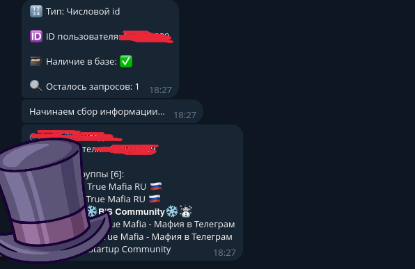<figcaption></figcaption></figure>

## **Этап 3**

### Узнаём номер телефона

Настал важнейший этап – это поиск номера телефона, который станет для нас ключом ко многим другим данным целевого пользователя. В этом пункте будут к сожалению лишь два бота, так как за мою практику это единственные бесплатный и условно-бесплатный боты, при помощи которых мне удавалось эффективно находить номера телефонов аккаунтов.

### **Telegram Analyst**

[Полностью бесплатный бот](https://t.me/TgAnalystbot), у которого небольшая база данных телеграм-аккаунтов и весьма редко может выдать что-то толковое, но иногда может повести.

<figure>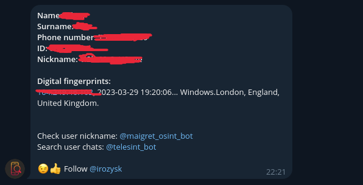<figcaption></figcaption></figure>

У этого бота весьма специфичный способ пополнения базы данных, при помощи ботов-ловушек. Актуальный их список к сожалению предоставить не смогу, но найти на нескольких тематических канал думаю не составит труда.

### **Unamer**

Ну и на десерт ещё [один замечательный и функциональный бот](https://t.me/unamer\_bot), который может выдать и историю имени аккаунта и с некоторой вероятностью номер телефона. К сожалению на внутреннюю валюту не такой щедрый как предыдущие боты, но и не тратит валюту в случае если информации не нашёл. Если рассматривать бесплатный вариант пользования, то он одноразовый, или жди несколько веков если тебе капнет что-то бонусом. Если же рассматривать платный вариант, то 11 токенов будут приравнены к 10$, что на момент написания статьи составляет около 930р.

<figure>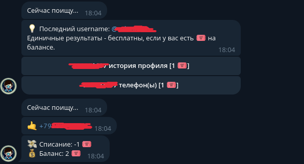<figcaption></figcaption></figure>

### **Заключение**

Надеюсь, что боты представленные мной в этой статье помогут в расследованиях и в накоплении опыта энтузиастов. Разумеется почти каждый этот бот условно-бесплатный и куда эффективней было бы использовать платные версии, с чем я охотно соглашусь. Но вы и согласитесь, что для платных версий ботов никаких гайдов и обзоров не нужно тем людям, которые преуспевают в сфере OSINT.
