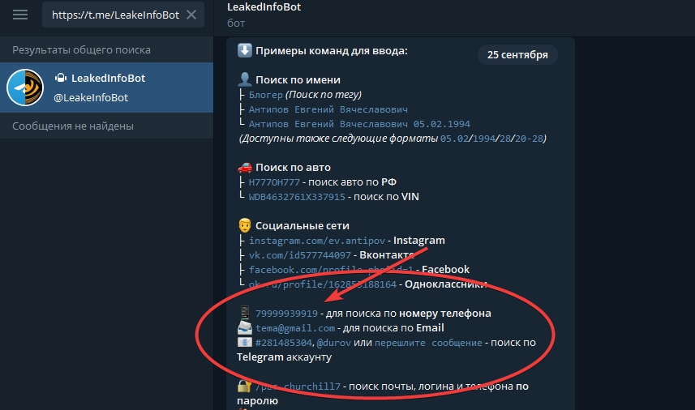
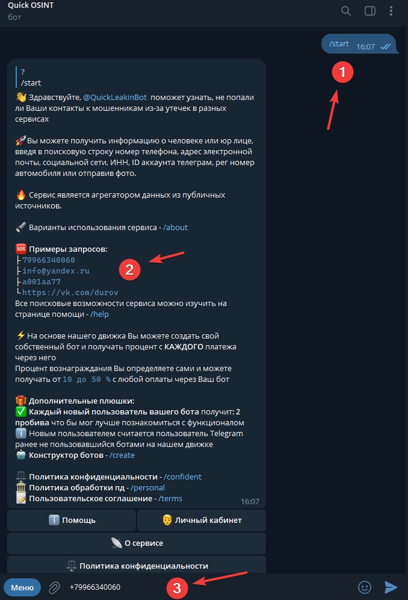
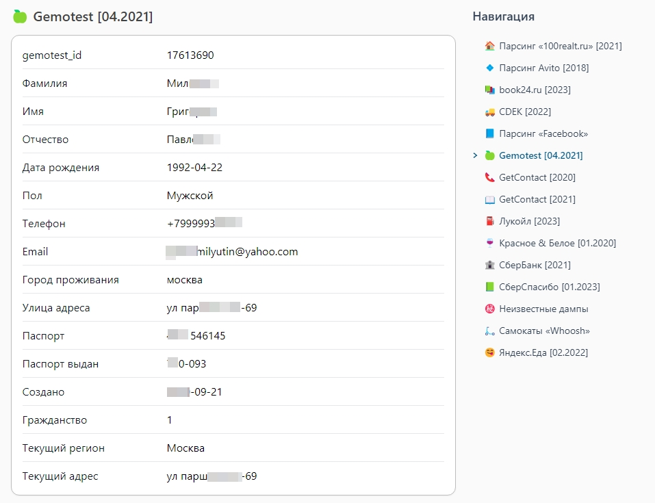

# Как пробивать номер телефона с помощью телеграм бота

<figure><figcaption></figcaption></figure>

Вы наверняка сталкивались с ситуацией, когда на ваш телефон поступил звонок от незнакомого номера, и вы задавались вопросами: "Чей номер телефона?", "Кто звонил по номеру телефона?" или "Как узнать информацию о номере телефона?". С развитием технологий стали доступными решения для подобных запросов. В этой статье мы рассмотрим, как использовать телеграм-ботов для "пробива" номеров телефонов и получения информации о владельцах.

### Пробив по номеру телефона: Шаг за шагом

1\. Начните с поиска бота: В Telegram есть ряд ботов, предоставляющих услуги по "пробиву" номеров телефонов. Однако в поиске Telegram существует множество мошеннических предложений и скама. В нашем блоге вы найдете лучших ботов, проверенных временем. Вот, например, один из самых топовых – [UsersBox](broken-reference) или [LeakedInfoBot](https://probivbot.blogspot.com/2023/02/blog-post\_21.html).

&#x20;2\. Активируйте бота: После нахождения подходящего бота, вам потребуется активировать его в своем аккаунте Telegram. Следуйте инструкциям бота для этого. В некоторых ботах необходимо отправить свой номер телефона для активации, в то время как в [UsersBox](broken-reference), например, нет необходимости отправлять ничего для активации.

<figure><figcaption></figcaption></figure>

&#x20;3\. Введите номер: После активации бота вам нужно будет ввести номер телефона, о котором вы хотите получить информацию. Важно вводить номер в правильном формате, чтобы избежать ошибок.

<figure><figcaption></figcaption></figure>

4\. Ожидайте результатов: Бот начнет обработку запроса и начнет поиск информации. Подождите некоторое время, пока бот соберет доступные данные, связанные с этим номером. Затем он предоставит вам отчет о всей найденной информации по вашему запросу.

<figure><figcaption></figcaption></figure>

### Ограничения и Предосторожности

Важно отметить, что информация, получаемая с помощью таких телеграм-ботов, может быть ограничена и не всегда полной. Точность и полнота данных зависят от источников и методов, используемых ботами. Кроме того, использование таких ботов должно соблюдать законодательство вашей страны и уважать приватность других.

В заключение, телеграм-боты предоставляют возможность узнать больше о номерах телефонов и их владельцах. Однако, используйте такие инструменты осторожно и ответственно, соблюдая закон и этические нормы.
