# OSINT — Начало пути

<figure><figcaption></figcaption></figure>

### Базовые правила

**Я бы хотел вынести основные вещи**, которые вы должны делать, чтобы получить максимальный результат.&#x20;

**Первое**: всегда записывайте и сохраняйте найденную информацию. Ваш поиск должен быть как пазл, вы собираете его по частям и в конце смотрите на картину. Порой, какой-то старый комментарий на форуме об автомобилях который вы сочли за мусор может стать той самой недостающей деталью. Также, **делайте копии страниц** **используя** [_**SingleFile**_](https://addons.mozilla.org/en-US/firefox/addon/single-file/), не поленитесь и создайте папку под каждую цель, сохраняя в неё всю найденную информацию.

**Второе**: выжимайте соки с каждой зацепки, даже если мысль кажется бессмысленной. Если вы нашли соц. сеть цели, максимально взаимодействуйте с ней. Речь о восстановлении пароля с целью узнать последние цифры номера/часть мыла, поиска старых упоминаний/никнеймов и прочее, зависит от ситуаций. Если Instagram покажет нам последние 2 цифры номера, мыло покажет средние 3, **этого уже вполне достаточно для сопоставления цепочки.**&#x20;

**Третье: соблюдай конфиденциальность.** Не используйте личные аккаунты поисковиков, личные telegram, которые можно связать с вашей личностью и прочее. Некоторые используют для регистраций личный email, оставляя везде свой цифровой след и тем самым подставляют свою задницу под очередной дамп, пополняя базы. Если ресурс вам не важен (второстепенные сайты для одноразового захода) — используйте [**одноразовое**](https://tempail.com/) мыло. Если нужно сохранить доступ к ресурсу — создайте ящик на [**proton.me**](http://proton.me). И нет, это дерьмо абсолютно не анонимно, не слушайте идиотов, которые твердят вам это. Но для наших целей — в самый раз! Оно удобно тем, что не требует никаких SMS для регистрации.\
В идеале ваш почтовый ящик должен выглядеть примерно вот так:\
`D5d5UM1R4iZiFA_{название сервиса}_86mWfFBed7dTN@proton.me`

<figure>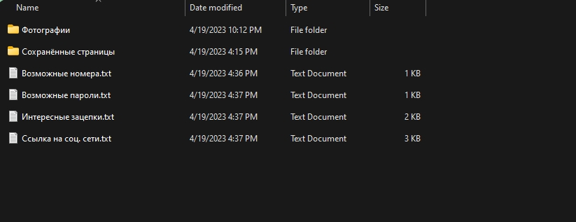<figcaption>
Пример папки для Osint
</figcaption></figure>

***

### Боты телеграм

Эти инструменты вы должны использовать в первую очередь. Они предоставят нам базовую информацию, с помощью которой мы сможем начать рыть наш "туннель". Искать в них можно все что угодно: телеграм, почту, номер, юзернейм и пр. Главное: не пробивайте там самих себя! Это первая, казалось бы, банальная ошибка, но её очень часто совершают многие опытные ребята=)

***

1. [**QuickLeak**](https://bit.ly/43mkGHO) **-** старый, легендарный бот. Есть 2 бесплатных запроса.&#x20;
2. [**UsersBox**](https://bit.ly/3PpjJJb) - тот самый "ЮзерБокс", в представлении не нуждается.
3. [**Himera**](https://bit.ly/3IHpP3K) - работает _не_ только по "открытым источникам".
4. [**LeakedInfonBot**](https://bit.ly/491Ajpj) - умеет искать практически по любой информации.

_Я не стану расписывать возможности каждого, они все выполняют одну функцию, только по разным базам. Не вижу смысла делать огромный список, главные тулзы при правильном использовании отлично делают свою работу._

***

### Социальная инженерия

Хотел выделить несколько строчек, потому что OSINT без использования СИ часто не выдаёт стоящего результата. Никогда не бойтесь общаться с целью, вы должны изучить её с ног до головы. Человек — это самая большая дыра в безопасности. Большинство преступлений раскрывается не из-за "продажного VPN", а из-за глупости особи за экраном. Я бы хотел показать вам кейс который мне показался забавным, но и в то же время неимоверно гениальным=)

<figure>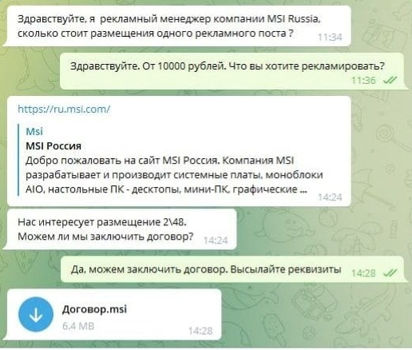<figcaption>
Пример социальной инженерии
</figcaption></figure>

Заметка: ".msi" файлы используются для установки приложений в среде Windows, этот тип так же как и ".exe" может вмещать в себе вредоносное П.О..

***

Это креативное занятие, которое в большинстве случаев требует индивидуального подхода к каждому человеку. Если вам интересно, обратите внимание на книгу "[**Социальная инженерия и этичный хакинг на практике (2022)**](https://xss.is/threads/71999/)". В ней описано множество методов атак, о которых вы, скорее всего даже и подумать не могли. К слову, об OSINT там тоже есть несколько толковых глав.\
Прекрасное чтиво перед сном, рекомендую от чистого сердца!

***

### Поисковики — главный инструмент

Эта та вещь, что специализируется на поиске. Им важно собрать как можно больше информации, чтобы составлять конкуренцию и завлекать аудиторию своими возможностями, это нам и нужно! По своему опыту могу сказать, что даже маленький, никому не нужный поисковик часто может выдать информации больше, чем гиганты. Поэтому, не стоит перебирать, все по своему хороши. **Главное — правильно искать**, чему сейчас мы и научимся. На примере у нас будет Google, но принцип работы практически везде ничем не отличается. Моделируем ситуацию: нам нужно произвести **точный запрос по номеру** телефона и отсеять другие похожие варианты. Для этого нам понадобится

***

сконструировать такой запрос, используя кавычки: `"74952247069"`

***

> **Заметка:** если вы ищете информацию, которая относится к какой-то стране, (пример: номер телефона) вам следует включить VPN той же страны. Таким образом можно получить больше информации, геопозиция решает!

<figure>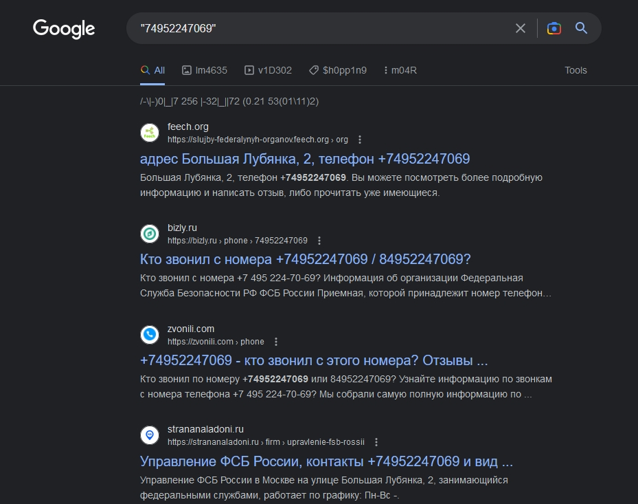<figcaption>
Конкретизация поискового запроса
</figcaption></figure>

Нам покажет **только 100%-тные упоминания**. Речь может идти не только о номере, а о другой информации: email, username, пароль, ФИО и пр.\
Но что если нам выкидывает кучу сайтов, которые не относятся к нашему запросу? Пример на скриншоте выше, речь о "кто звонил" и прочих. Мы также сможем исключить их по ключевых словах. Это может быть полезно, если у человека о котором вы пытаетесь узнать информацию есть однофамилец, и он занимается публичной деятельностью. Для этого нужно используя "-" написать популярные синонимы к возможным словам и выполнить запрос как ниже:

***

`"74952247069" -звонил -узнать -информация -проверить`

***

<figure>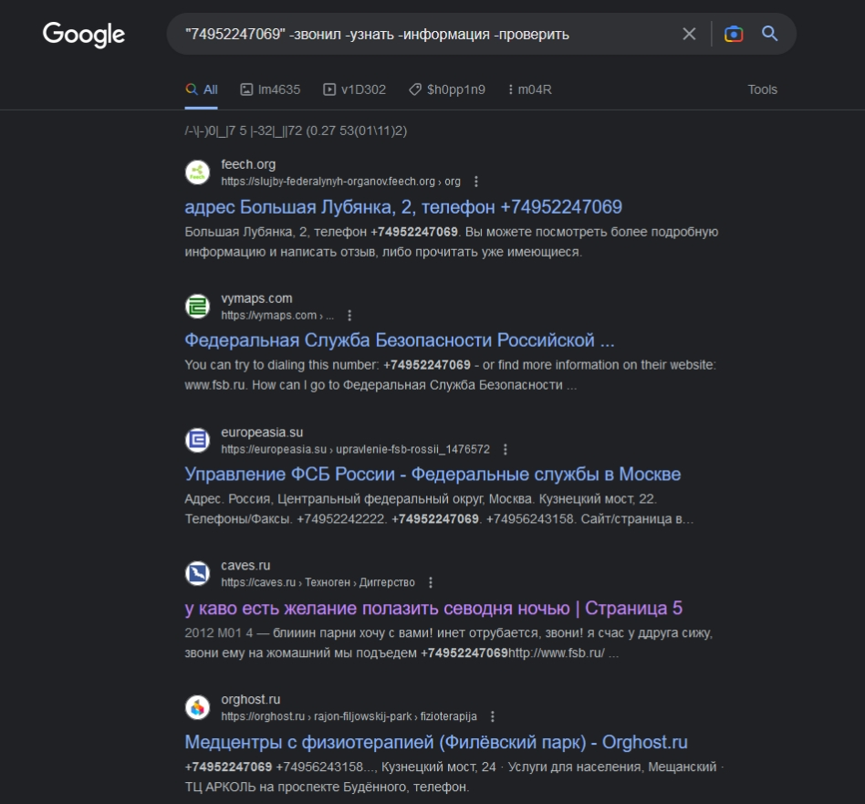<figcaption>
Исключаем слова из поиска
</figcaption></figure>

Также существует сайт, который поможет вам сгенерировать правильный запрос для Google. Тут собраны все подобные методы, которые вы также можете использовать, чтобы добиться лучшего результата. [**Нажмите для перехода**](https://dorksearch.com/).

<figure>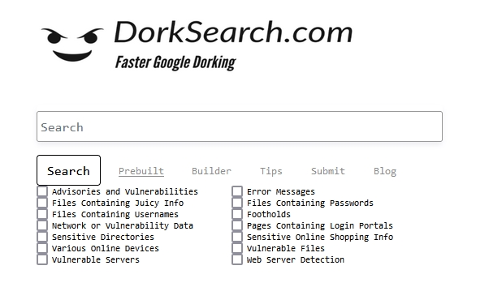<figcaption>
Сайт для создания Google дорков
</figcaption></figure>

Как я и упоминал, нужно прогонять информацию в разных поисковиках. Я оставлю вам скромный список:

***

* https://intelx.io/
* https://searx.tiekoetter.com/
* https://search.carrot2.org/
* https://www.google.com
* https://www.bing.com/
* https://yandex.com/
* https://duckduckgo.com/
* http://boardreader.com/
* http://www.dogpile.com/
* https://search.creativecommons.org/
* https://www.startpage.com/

***

### Поиск по username

Некоторые пользователи используют один и тот же ник на сайтах, что поможет нам собрать больше информации. Для этой цели существует много ботов, но именно этот используется осинтерами больше всего: [**@maigret\_osint\_bot**](https://t.me/osint\_maigret\_bot)

<figure>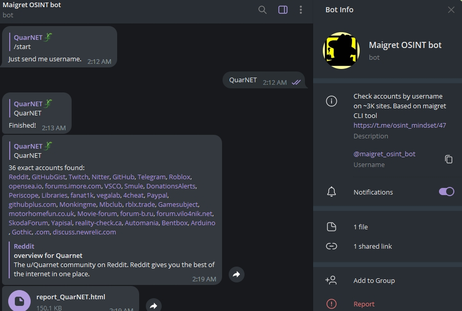<figcaption>
Поиск в боте Maigret
</figcaption></figure>

Как заявляют разработчики, поиск производится на 3.000 сайтах.\
Бот может часто лежать, поэтому советую установить [**утилиту**](https://github.com/soxoj/maigret) на которой он основан сразу к себе в машину. Таким образом поиск будет более точным, потому что прокси бота частенько залетают в ~~**blacklist**~~ и не сканируют должным образом.\
Для этой цели также можно использовать поисковики, таким образом мы, вероятно, сможем получить кешированные страницы и просмотреть их копию.\
Также не стоит забывать, что многие используют **username в почте**.\
[**Есть бот**](https://t.me/mailcat\_s\_bot), который переберёт почтовые домены в автоматическом режиме.\
Его тоже можно установить себе на компьютер и [**сканировать эффективнее**](https://github.com/sharsil/mailcat).

<figure>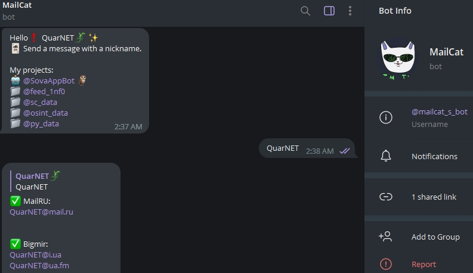<figcaption>
Поиск почты используя MailCat
</figcaption></figure>

> Заметка: попробуйте восстановить пароль от аккаунта на найденных сайтах. Вам с огромной вероятностью покажет часть почты/номера телефона.

***

### Поиск по номеру телефона

Имея на руках номер, вы открываете себе возможность устроить полный шпионаж, все зависит от размера вашего кошелька, обговорим это ниже=)\
Но что если весь ваш доход — карманные деньги от родителей? Не волнуйтесь, для вас тоже есть куча бесплатных возможностей. Например, можно воспользоваться сайтом, который хранит в себе терабайты русских утечек.\
Для доступа нужно будет воспользоваться средствами смены IP, потому что власти не разделяют наши интересы и заблокировали ресурс=) [**Перейти на сайт**](https://saverudata.online/).\
Это самый мощный и бесплатный инструмент по России. Если вы заказывали еду, ваши адреса, скорее всего, дополняют базу данных, советую проверить.

<figure>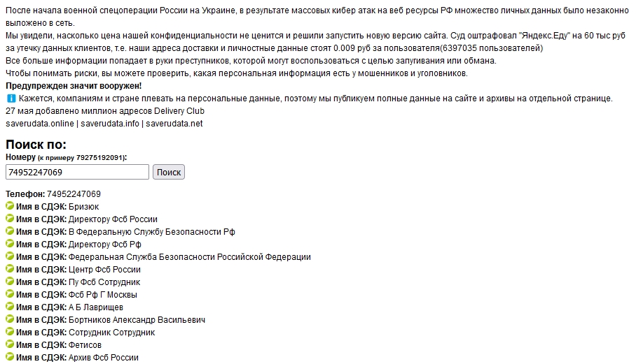<figcaption>
Поиск на сайте saverudata
</figcaption></figure>

Что делать если цель из другой страны? Попробуйте воспользоваться [**GetContact**](https://getcontact.com/). Это приложение является огроменной базой информации о номерах, но ни в коем случае не устанавливайте это себе на личное устройство! Принцип его работы основан на том, чтобы добывать данные со своих пользователей.

\
Да-да, вы его установили и одновременно слили всю свою контактную книгу=)\
Гениальный, коварный ход, но для наших целей является золотым звеном. Воспользуйтесь эмуляторами для того, чтобы не стать жертвой самостоятельно.

<figure>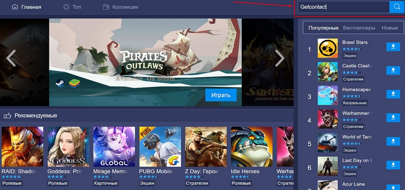<figcaption>
Поиск Getcontact в эмуляторе
</figcaption></figure>

Существует бот, который производит поиск по базе _GetContact_. [**Перейти**.](https://t.me/allcontacts\_real\_bot)\
_Бесплатно можно совершить 7 запросов, после:_ 10 запросов = 100 руб

<figure>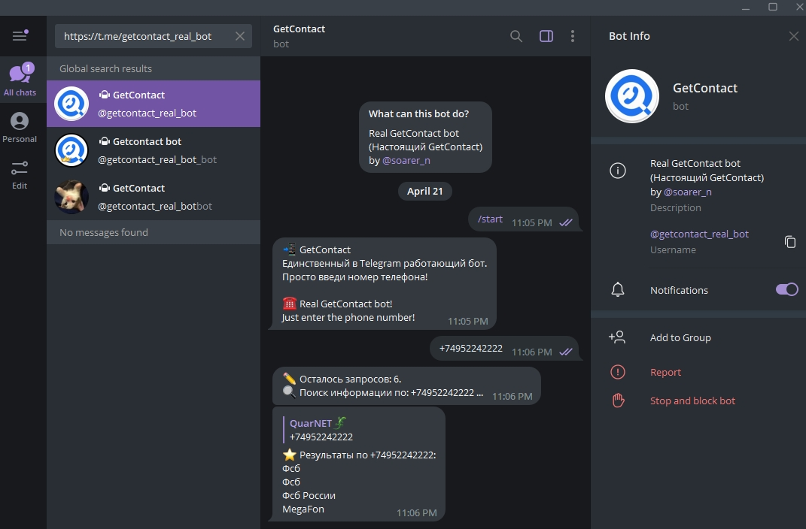<figcaption>
Telegram бот для поиска по базе Getcontact
</figcaption></figure>

Для более глубокого результата, попробуйте добавить номер жертвы в `Telegram/WhatsApp/Viber/Signal`. Есть шанс получить фотографии & ФИО.\
А что если у вас есть деньги? Тогда ваши возможности не ограничиваются, вы сможете узнать местоположение цели/историю звонков/паспортные данные и многое другое! Естественно, это противоречит законодательству многих стран и автор осуждает подобные методы добычи информации. Стоит упомянуть, что на `15/04/2023` начали закручивать гайки, сейчас рынок намного сократился, все DarkNet комьюнити наблюдают над ситуацией. Активные позиции все-таки есть, и я продемонстрирую вам скриншот, чтобы вы знали цену своим данным.\
Ссылки не оставляю. Вспомните о чём статья и реализуйте свои навыки=)

<figure>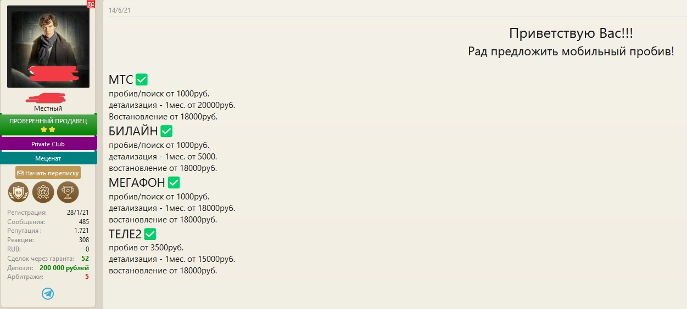<figcaption>
Теневые услуги и расценки
</figcaption></figure>

***

### Поиск по Email

Мыло = ключ к всей информации, поэтому обязательно проверяйте его на утечки пароля. Для этого используются такие сервисы как: [**PasswordSearch**](https://t.me/PasswordSearchBot), [**intelx**](https://intelx.io/), [**leackcheck**](http://leakcheck.io). На самом деле их намного больше, но это одни из самых мощных.

<figure>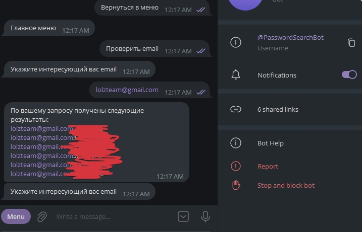<figcaption>
Результат проверки почты на утечки
</figcaption></figure>

Также существует сервис, который найдёт соц. сети по email — [**Seon**](https://seon.io/). Он бесплатен, имеет приятный вывод информации и не требует авторизации.

<figure>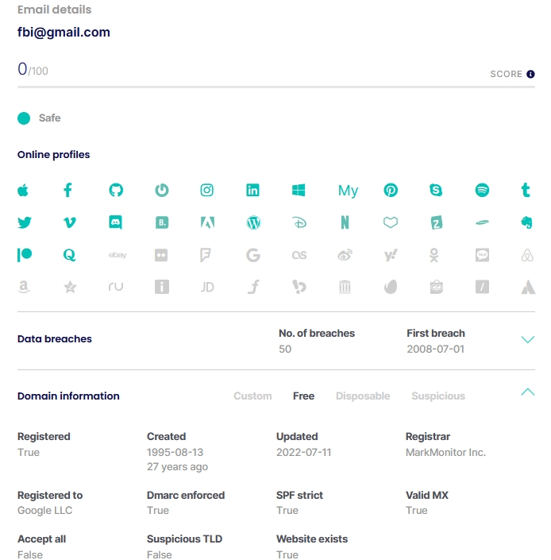<figcaption>
Поиск соц. сетей используя Seon
</figcaption></figure>

***

### Поиск по лицу

Для этой задачи я использую [**PimEyes**](https://pimeyes.com/). Превосходный сервис который предоставляет нам 3 бесплатные попытки в 24ч., но посредством смены IP\&FingerPrint можно легко обойти это ограничение и пользоваться без ограничений. К слову, регистрация не требуется. На все найденные изображения прилагается источник. Это действие может быть полезно для дополнительного сбора информации, когда мы уже имеем на руках фотографию цели.

<figure>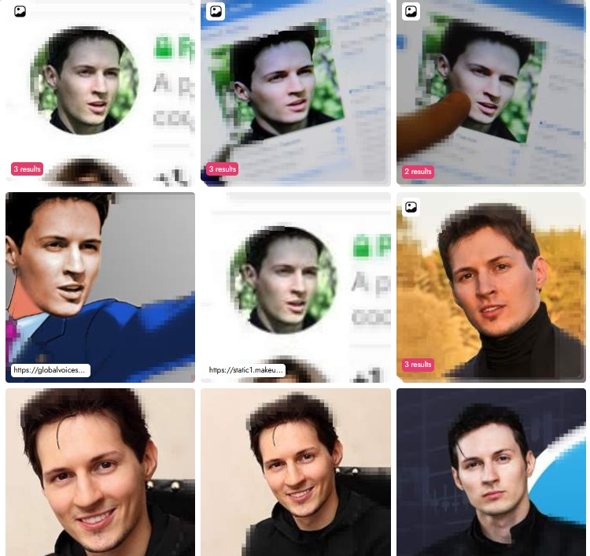<figcaption>
Результат поиска в PimEyes
</figcaption></figure>

Так же есть неплохой аналог — [**Search4Faces**](https://search4faces.com/), он тоже бесплатен, но ищет по соц. сетям. Я заметил что его результаты в некоторых ситуациях слегка лучше, поэтому, в идеале использовать оба сервиса для лучшего исхода.

<figure>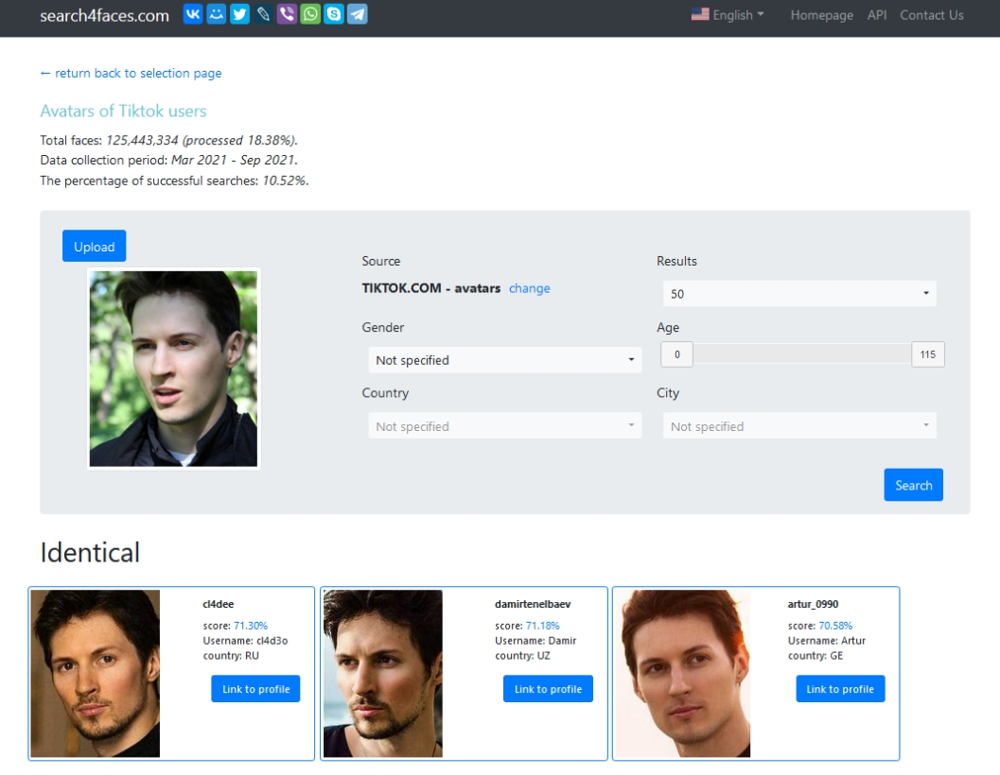<figcaption>
Результат поиска в search4faces
</figcaption></figure>

***

